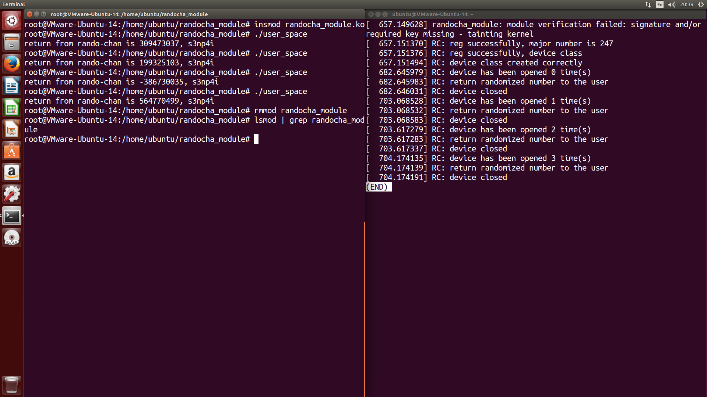

# Tìm hiểu về Linux kerneldd

## `randomchar`

### Hướng dẫn nhanh

```bash
// Build module và user tool
$ make

// Nạp module
# insmod randomchar.ko

// Chạy user tool để thử
# ./user_space

// Gỡ module
# rmmod randomchar

// Dọn dẹp
$ make clean
```


### Ảnh chụp chạy mẫu



Hình: `randomchar_module` đã được nạp thành công; công cụ test đã được gọi 4 lần.
